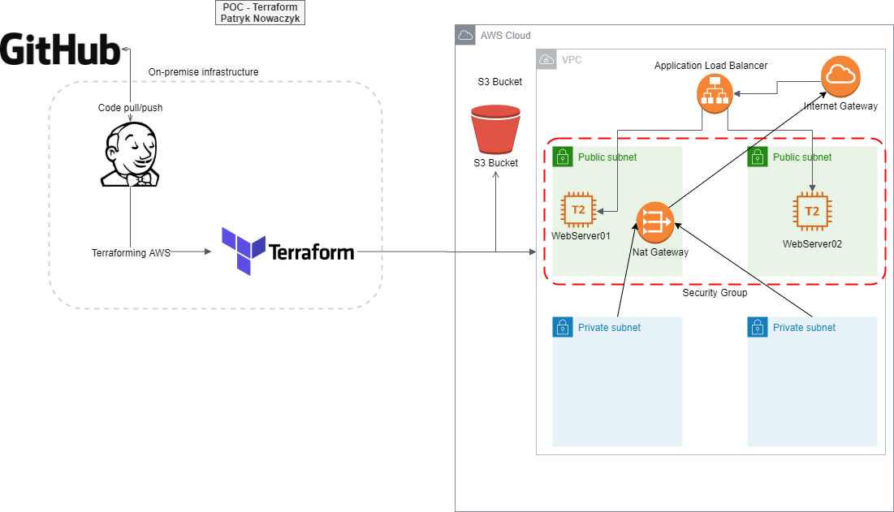

# Proof of Concept
**Description**

Project aims to deliver IaC deployment based on AWS cloud services + combined onpremise automation infrastracture using jenkins and terraform.

**Design**

**Detailed overview**

The project is divided intentionally into two separate parts: on-premise infrastructure that emulates customer and Cloud environment where infrastructure will be deployed.

On-premises infrastructure consist of the following automation elements:
- Jenkins - orchestrator for triggering JOBS
- Terraform - deploying resources to the cloud

Using jenkins project (execute shell) to applies to terraform configuration which will deploy infrastructure in AWS. Terraform.tfstate will be saved in S3 bucket which was created earlier. Also, Jenkins has configured webhooks with Github.
Nat Gateway is aleady created which means we can add here bastion host, to connect to databases if we will create them in private subnets. After configuration we can update our databases without connection with internet.
